# Semantic Poem Search Demo using GNES

This demo shows you how to build a semantic poem search using GNES. 

## Prerequisite

You need to have [Docker](https://docs.docker.com/install/) installed on your machine.

As a start, run the following command to initialize the Docker Swarm environment.

```bash
docker swarm init
``` 

## 1. Build images from local

```bash
make build
```

### (Optional - Not yet available on dockerhub) Download pre-built images

If you have trouble building images yourself (e.g. due to slow connection or proxy issues), you can also pull our pre-build images for this demo. However, they may be outdated.   

```bash
make pull
```


## 2. Index all poems

```bash
# start the index server stack
make index
# wait for a minute until all services started and grpc is ready
make client_index
```

<p align="center">
<a href="https://gnes.ai">

</a>
</p>

## 3. Query and show top-10 poems

```bash
# start the query server stack
make query
# wait for a minute until all services started and grpc is ready
make client_query
```
<p align="center">
<a href="https://gnes.ai">

</a>
</p>


## Other commands

| Command | Description |
|---|---|
| `make clean` | Remove all docker stacks and release all network resources |
| `make clean_data` | Remove all index files in `.cache` |
| `make deploy_query` | Deploy the stack described in `demo-poem-query.yml` for query |
| `make deploy_index` | Deploy the stack described in `demo-poem-index.yml` for index |

## Next steps

There are many ways to improve the quality of search results. To name a few,

- **Score function**: right now the demo is using the average of all chunks' scores as the final relevance score. This can be improved by using more sophisticated scoring functions [as listed here](http://doc.gnes.ai/en/latest/api/gnes.score_fn.html).
- **Encoder**: instead of using pytorch-transformers or Flair, you can customize or build your new encoder pipeline. See how we build our own Flair [in this demo](flairencode/my_flair.py) and import it into GNES using [`--py_path`](flairencode/Dockerfile). 
- **Preprocessor**: this demo split a document into chunks using punctuations (the default behavior of `SentSplitPreprocessor`), you may   customize it as well.

If you find any interesting results, please feel free to contribute.

> We are considering using this demo as a part of integration test and add it to the CICD pipeline of [GNES master](https://github.com/gnes-ai/gnes). So we may keep the master branch of this demo as simple as possible 

## Troubleshooting

#### `Failed to remove some resources from stack: my-gnes`

If you encounter the following errors when doing `make`, simply wait for couple of seconds. Docker is sometimes slow on recycling network device.

```bash
rm -rf .cache && mkdir .cache && docker stack rm my-gnes
Removing network my-gnes_default
Failed to remove network b0ei205abak98pn84yj9f6u70: Error response from daemon: network b0ei205abak98pn84yj9f6u70 not foundFailed to remove some resources from stack: my-gnes
make: *** [clean] Error 1
```

```bash
Creating service my-gnes_Router40
failed to create service my-gnes_Router40: Error response from daemon: network my-gnes_default not found
make: *** [deploy] Error 1
```

#### Force rebuilding images after code change

Thanks to the Docker cache, local change on the code may not be directly reflected in the Docker image. Therefore you can find placeholder such as `RUN echo 5` in some `Dockerfile`. Increase this number will trigger `make build` to rebuild the image accordingly.


#### Be careful on the version mismatch

To update the local GNES image, please do `docker pull gnes/gnes:latest-alpine` **before**  `make build`.

